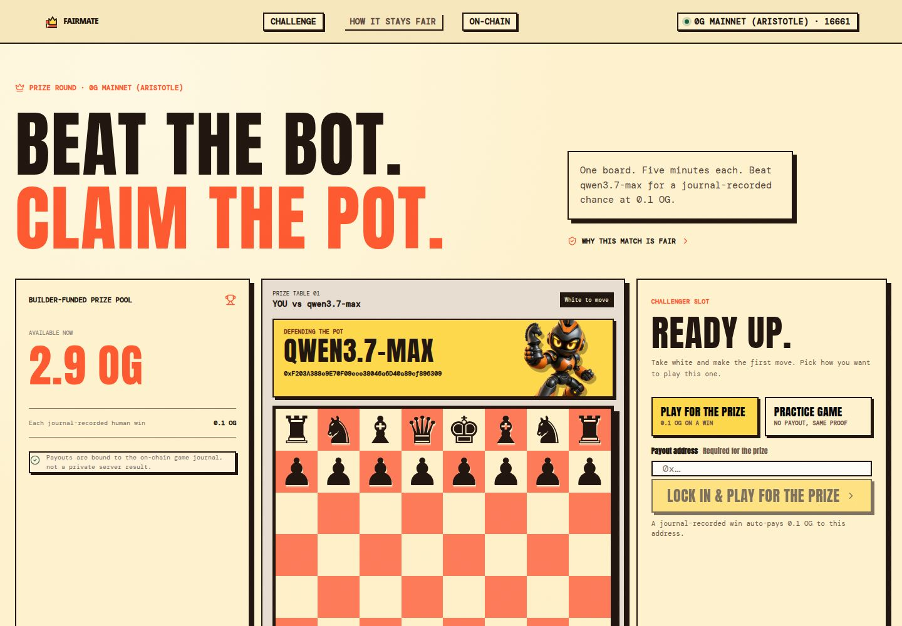
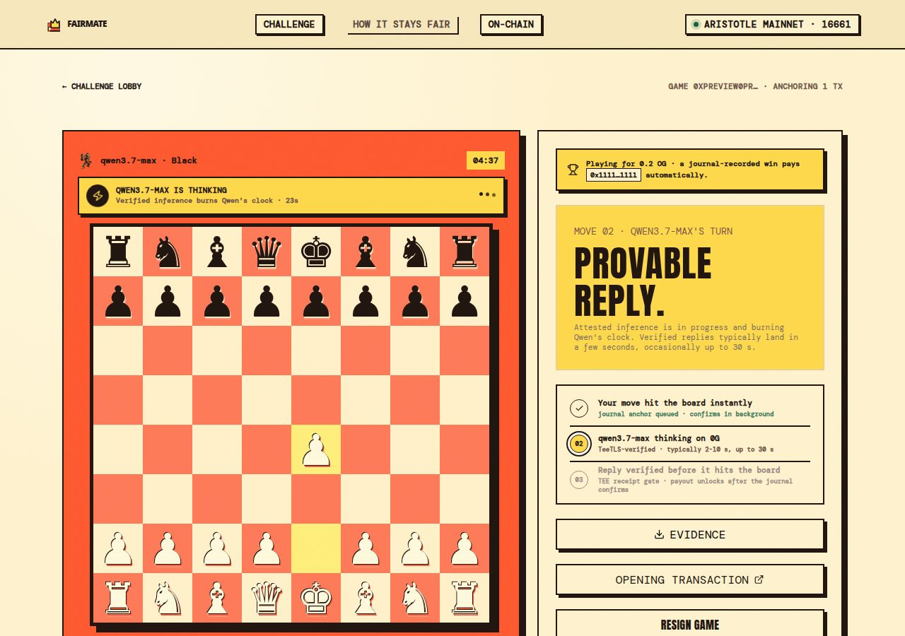
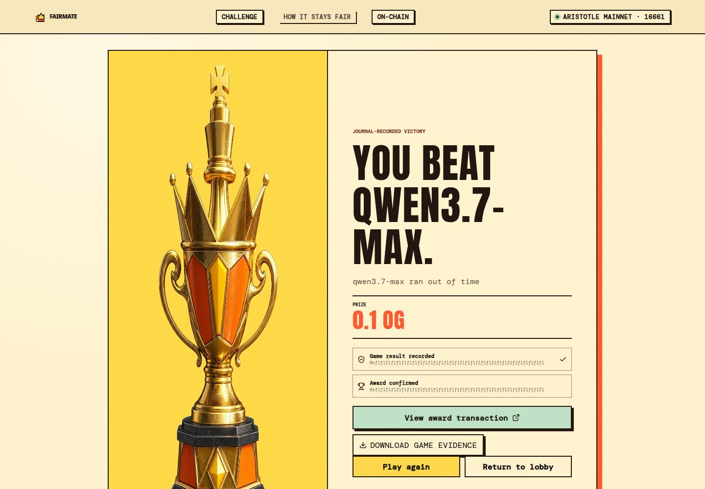

# FairMate

**Beat a TeeTLS-verified chess rival. Win 0.1 OG from a builder-funded pot.**

**Live: [fairmate-cyan.vercel.app](https://fairmate-cyan.vercel.app)**

FairMate is five-minute chess against `qwen3.7-max` on 0G. Model moves are legal-gated by `chess.js`, verified through 0G Router, committed to a public game journal, and tied to a real mainnet payout.

Entry is free. Players never stake funds. The prize comes from a builder-funded contract.



## The judge loop

| Step | What happens | Public proof |
|---|---|---|
| 1 | A player opens a 5+0 game as White | [`GameStarted`](https://chainscan.0g.ai/tx/0xb0fb7c2040469b31e8eb02b012f15662f11fcfd96df903c0e102dba58db58cff) on Aristotle Mainnet |
| 2 | Every human move hits the board immediately | The chain anchor enters a strict FIFO outbox and confirms behind the game |
| 3 | Qwen replies through 0G Router with TeeTLS verification enabled | Exact request and response bytes are committed into the move receipt |
| 4 | Every ply commits SAN, before and after FEN hashes, mover, and receipt hash | [`MoveJournal`](https://chainscan.0g.ai/address/0x78718E892705129417636F70ceE11A97ca5AD726) |
| 5 | A journal-recorded human win unlocks the prize | [`0.1 OG award`](https://chainscan.0g.ai/tx/0xac8277b8f730ea565884aaac3829c2b96049f5af831c2e6de64f0a5f51b8fff8) from [`ChallengePot`](https://chainscan.0g.ai/address/0x9BD5f06Ce7aB22dfF739Ed2b2886BfB49acc69Ef) |



## Why 0G is essential

FairMate does not add blockchain after the game. The game depends on two 0G primitives:

### 0G Router

The model request sets `verify_tee: true` and pins both `qwen3.7-max` and the selected provider. FairMate rejects a response before it reaches the board when any of these drift:

- TeeTLS verification result
- model or provider identity
- request and response byte hashes
- billing trace arithmetic
- legal SAN binding to the current FEN

### 0G Chain

The journal is the shared source of settlement truth. Each move stores:

```text
gameId
moveNo
mover
SAN
fenBeforeHash
fenAfterHash
receiptHash
```

The prize contract reads the recorded game result and player address. It prevents redirection, double payment, over-cap payment, and awards for unfinished or non-winning games.

## Instant play, final chain truth

Mainnet confirmations should not freeze a chess clock.

FairMate applies the board, clock, and turn change immediately, then sends the chain commitment through a trailing FIFO outbox. Signed transaction bytes are persisted before broadcast, nonce order is serialized across replicas, and restart recovery resumes from the queue head.

A definitive move-anchor revert fails closed:

1. Roll back to the last confirmed journal position
2. Clear every dependent queued action
3. Abort the game
4. Void any unpaid optimistic prize marker

Model receipt verification remains synchronous. Only the journal transaction trails behind the game.

## Mainnet evidence

| Artifact | Link |
|---|---|
| Network | 0G Mainnet, Aristotle, chain `16661` |
| Model | `qwen3.7-max` |
| Router provider | [`0xF203...6309`](https://chainscan.0g.ai/address/0xF203A388e9E70F09ece38046a6D40a89cf896309) |
| MoveJournal | [`0x7871...D726`](https://chainscan.0g.ai/address/0x78718E892705129417636F70ceE11A97ca5AD726) |
| ChallengePot | [`0x9BD5...69Ef`](https://chainscan.0g.ai/address/0x9BD5f06Ce7aB22dfF739Ed2b2886BfB49acc69Ef) |
| Pot funding | [`3 OG`](https://chainscan.0g.ai/tx/0x42108033ebc8f6a0a38176c890a126528952f6253d38eaed88ca0fed42ffc558) |
| Sample game start | [`0xb0fb...8cff`](https://chainscan.0g.ai/tx/0xb0fb7c2040469b31e8eb02b012f15662f11fcfd96df903c0e102dba58db58cff) |
| Sample game end | [`0x421d...f07f`](https://chainscan.0g.ai/tx/0x421d7e2a19000d58d220e41e8df8e2a3d716cf0429ab46c114e6195fef27f07f) |
| Sample game award | [`0xac82...fff8`](https://chainscan.0g.ai/tx/0xac8277b8f730ea565884aaac3829c2b96049f5af831c2e6de64f0a5f51b8fff8) |
| Base to 0G funding route | [`0x50e8...ddfd`](https://basescan.org/tx/0x50e8c9b1e24320a3137bf4a9f91581f2c74de0fadd5ece530adbecb4e98fddfd) |

The bundled verifier passed **581 of 581** mainnet checks across deployment state, Router evidence, chess replay, per-ply events, transaction receipts, and payout constraints.

```bash
pnpm run verify -- --network=mainnet
```

This command reads bundled evidence and public chain state. It does not send a transaction.



## Trust boundary

| Independently checked | Explicitly trusted |
|---|---|
| Exact Router request and response bytes | 0G Router's TeeTLS verification assertion |
| Model and provider pins | Referee availability |
| Billing trace consistency | Referee submits the clock-derived result |
| Full SAN and FEN replay | |
| On-chain move commitments | |
| Prize contract conditions | |

The referee cannot redirect or double-pay a recorded win. It could refuse to submit one. That refusal remains auditable from the exported SAN and FEN evidence against the public journal.

## Contracts

`contracts/FairMate.sol` contains:

- `MoveJournal`, append-only game start, move commitment, and result records
- `ChallengePot`, builder-funded and permissionless award execution

The pot enforces one award per game and a rolling 24-hour payout cap. Negative-path evidence in `evidence/pot-drill.mainnet.json` covers double-award, model-win, missing-player, cap-exceeded, ongoing-game, unknown-game, stranger-write, post-end-commit, and receiptless-model-move reverts.

## Run locally

Requirements:

- Node.js 20 or newer
- pnpm 9 or newer
- PostgreSQL 15 or newer

```bash
git clone https://github.com/bunnyyxtan/fairmate.git
cd fairmate
pnpm install
cp .env.example .env
pnpm run db:migrate
pnpm dev
```

For the production Router flow, set `OG_ROUTER_API_KEY` and `OG_WALLET_PRIVATE_KEY` in your environment. Never place either value in source control.

## Quality gates

```bash
pnpm run typecheck
pnpm test
pnpm run build
pnpm run verify -- --network=mainnet
```

The test suite covers:

- strict model-output parsing and corrective retries
- TeeTLS, provider, model, and price-policy rejection
- chess clock behavior
- PostgreSQL advisory locking and inference leases
- persisted signed transaction recovery
- FIFO nonce ordering across replicas
- optimistic move application
- rollback and fail-closed payout behavior

## Project map

```text
app/          React game interface
contracts/    MoveJournal and ChallengePot
db/           PostgreSQL pool and explicit schema migration
evidence/     Mainnet proof bundles
scripts/      verifier, deployment, drill, and balance tools
server/       referee, durable outbox, Router and chain adapters
shared/       wire protocol and receipt validation
src/          reusable Compute and evidence modules
```

## License

MIT